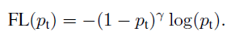
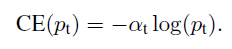

# Focal Loss for Dense Object Detection

## # Summary
- Focal Loss proposal to solve class imbalance. [1]
- The paper used multi-scale feature pyramid like SSD and FPN.

## # Difference from Paper
1. Smooth L1 Loss -> GIoU
2. Momentum Optimizer -> Adam Optimizer

## # Reference
- Focal Loss for Dense Object Detection [[Paper]](https://arxiv.org/abs/1708.02002)
- Generalized Intersection over Union: A Metric and A Loss for Bounding Box Regression [[Paper]](http://openaccess.thecvf.com/content_CVPR_2019/papers/Rezatofighi_Generalized_Intersection_Over_Union_A_Metric_and_a_Loss_for_CVPR_2019_paper.pdf) [[Code]](https://github.com/OFRIN/Tensorflow_GIoU)
